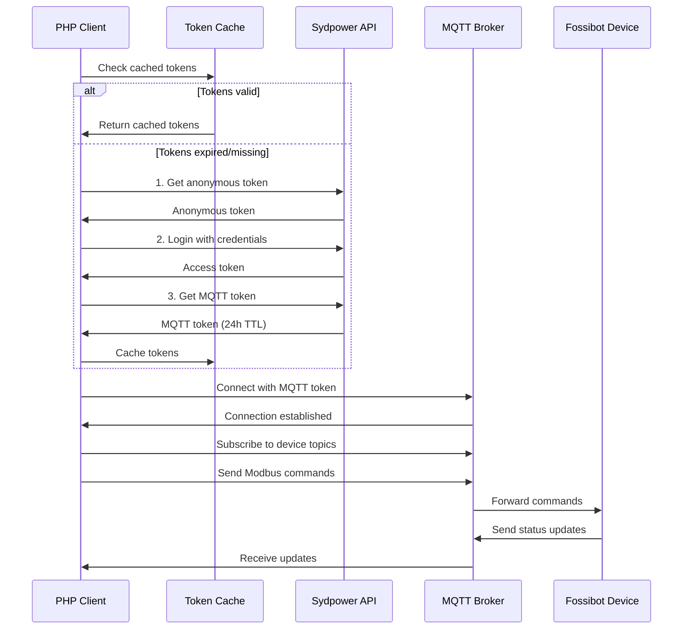
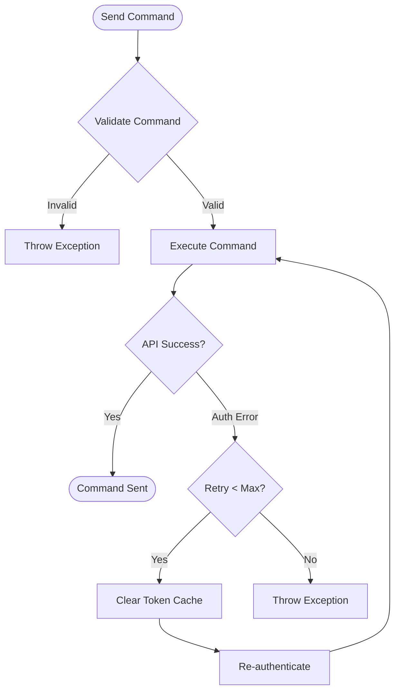

# Fossibot PHP Control Library

A comprehensive PHP library for controlling Fossibot power stations (F2400, F3600 Pro) via the Sydpower API. This library provides direct MQTT communication, smart caching, and automatic error recovery for production-ready integration.

## 🔗 Inspiration

This project was inspired by the original reverse engineering work at [iamslan/fossibot-reverse-engineering](https://github.com/iamslan/fossibot-reverse-engineering). We extend their Node.js implementation with a pure PHP solution that's designed for server-side automation and smart home integration.

## ✨ Features

- **🔐 Complete Authentication Flow**: Anonymous tokens, login tokens, and MQTT access tokens
- **⚡ Direct MQTT Communication**: WebSocket-based real-time device control (no Node.js dependency)
- **🧠 Smart Token Caching**: 24-hour token persistence with automatic refresh
- **🛡️ Device Safety**: Strict validation prevents dangerous commands that could brick devices
- **🔄 Auto-Recovery**: Automatic re-authentication when app usage invalidates tokens
- **🏠 USV Mode**: Optimized for UPS/backup power scenarios

## 🏗️ Architecture

### High-Level System Overview

```mermaid
graph TB
    subgraph "PHP Application"
        App[Your PHP App]
        Client[SydpowerClient]
        Cache[TokenCache]
        Modbus[ModbusHelper]
        MQTT[MqttWebSocketClient]
    end
    
    subgraph "Sydpower Cloud"
        API["Sydpower API<br/>api.next.bspapp.com"]
        MQTTBroker["MQTT Broker<br/>mqtt.sydpower.com:8083"]
    end
    
    subgraph "Device"
        Device["Fossibot F2400/F3600"]
    end
    
    App --> Client
    Client --> Cache
    Client --> Modbus
    Client --> MQTT
    Client --> API
    MQTT --> MQTTBroker
    API --> Cache
    MQTTBroker --> Device
    Device --> MQTTBroker
```

### Authentication Flow



### Command Execution with Auto-Retry



## 🚀 Quick Start

### Installation

```bash
# Clone this repository
git clone https://github.com/yourusername/fossibot-php-control.git
cd fossibot-php-control

# Copy configuration
cp config.php config.local.php
# Edit config.local.php with your credentials
```

### Basic Usage

```php
<?php
require_once 'SydpowerClient.php';

// Initialize client
$client = new SydpowerClient('your-email@example.com', 'your-password');

// Authenticate (uses cache when available)
$client->authenticate();

// Get devices
$devices = $client->getDevices();
$deviceId = $client->getDeviceIds()[0];

// Connect to MQTT
$client->connectMqtt();

// Send commands
$client->sendCommand($deviceId, 'REGMaxChargeCurrent', 5);  // Set 5A charging
$client->sendCommand($deviceId, 'REGChargeUpperLimit', 800); // Set 80% limit

// Clean up
$client->disconnect();
```

### USV/UPS Mode Configuration

```php
// Configure for backup power usage (minimal charging)
$client->sendCommand($deviceId, 'REGMaxChargeCurrent', 1);    // 1A minimum
$client->sendCommand($deviceId, 'REGChargeUpperLimit', 800);  // 80% limit

// Later: Enable full charging during cheap electricity
$client->sendCommand($deviceId, 'REGMaxChargeCurrent', 20);   // 20A maximum
$client->sendCommand($deviceId, 'REGChargeUpperLimit', 1000); // 100% limit
```

## 🛡️ Safety Features

### Command Validation

All commands are validated against device specifications before transmission:

- **Charge Current**: Only 1-20A allowed
- **Charge Limits**: 0-1000 permille, divisible by 5 or 10
- **Dangerous Commands Blocked**: Commands that could brick the device are not exposed

### Safe Command List

```php
// ✅ Safe commands (whitelisted)
'REGRequestSettings'      // Read device status
'REGMaxChargeCurrent'     // 1-20A only
'REGChargeUpperLimit'     // 0-1000 permille
'REGStopChargeAfter'      // Timer-based charging
'REGEnable/DisableUSBOutput'  // USB control
'REGEnable/DisableDCOutput'   // DC control  
'REGEnable/DisableACOutput'   // AC control

// ❌ Dangerous commands (blocked)
'REGSleepTime'           // Value 0 = DEVICE BRICK!
```

## 📁 File Structure

```
├── SydpowerClient.php      # Main client class
├── MqttWebSocketClient.php # MQTT WebSocket implementation
├── ModbusHelper.php        # Modbus protocol & validation
├── TokenCache.php          # JWT token caching system
├── config.php              # Configuration template
├── safe-test.php          # Safe testing script
├── example-direct.php     # Interactive example
└── test-retry.php         # Auto-retry testing
```

## 🔧 Configuration

### config.local.php
```php
<?php
return [
    'username' => 'your-email@example.com',
    'password' => 'your-password',
    'device_id' => null, // Auto-detect or specify
    'bridge_host' => 'localhost',
    'bridge_port' => 3000
];
```

## 🧪 Testing

```bash
# Test basic functionality
php safe-test.php

# Test auto-retry mechanism
php test-retry.php

# Interactive control
php example-direct.php
```

## 🔄 Token Management

### Automatic Caching
- **MQTT Tokens**: 24-hour validity, auto-refresh when <1 hour remaining
- **Access Tokens**: ~10 years validity
- **Cache Location**: `cache/tokens_<hash>.json` (gitignored)

### Manual Cache Management
```php
// Check token status
echo $client->getTokenInfo();

// Clear cache (force re-authentication)
$client->clearTokenCache();
```

## ⚠️ Important Notes

### App Interaction
- **BrightEMS app login may invalidate PHP sessions**
- **Auto-retry mechanism handles this gracefully**
- **No manual intervention required**

### Device Safety
- **Never set "whole machine unused time" to 0** - this will brick your device
- **All dangerous registers are blocked by default**
- **Validation exceptions prevent invalid values**

## 🏠 Home Assistant Integration

This library is perfect for Home Assistant automation:

```php
// Morning: Cheap electricity
$client->sendCommand($deviceId, 'REGMaxChargeCurrent', 20);

// Evening: Expensive electricity  
$client->sendCommand($deviceId, 'REGMaxChargeCurrent', 1);
```

## 📊 Performance

- **First authentication**: ~3 seconds (3 API calls)
- **Cached authentication**: ~0.1 seconds (from file)
- **Command execution**: ~1 second (MQTT)
- **Auto-retry overhead**: +3 seconds when needed

## 🤝 Contributing

1. Fork the repository
2. Create your feature branch (`git checkout -b feature/amazing-feature`)
3. Test thoroughly with `safe-test.php`
4. Commit your changes (`git commit -m 'Add amazing feature'`)
5. Push to the branch (`git push origin feature/amazing-feature`)
6. Open a Pull Request

## 📄 License

This project is licensed under the MIT License - see the [LICENSE](LICENSE) file for details.

## 🙏 Acknowledgments

- Original reverse engineering by [iamslan](https://github.com/iamslan/fossibot-reverse-engineering)
- Sydpower API investigation and MQTT protocol analysis
- Community testing and feedback

## ⚡ Supported Devices

- Fossibot F2400
- Fossibot F3600 Pro
- Other Sydpower-based devices (untested)

---

**⚠️ Disclaimer**: Use at your own risk. The authors are not responsible for any damage to your devices. Always test with safe values first.